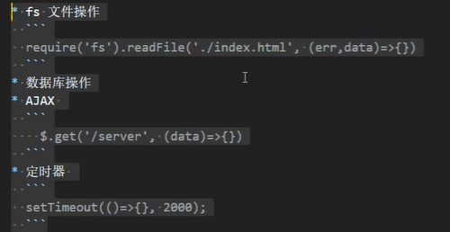
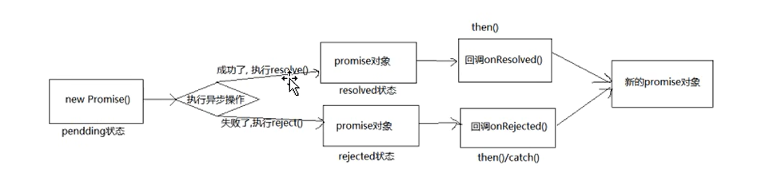

# ES6-Promise

## Promise理论知识

**promise本质 不是控制 异步代码的执行顺序（无法控制） ， 而是控制异步代码结果处理的顺序**

### Promise是什么？

1. 抽象表达

   - `Promise`是一门新的技术（ES6规范)

   - `Promise`是`JS`中进行**异步编程**的新解决方案(旧方案：使用回调函数)

     

     - **异步编程**
       
       - `fs `文件操作
       
         ```js
         // 回调函数写法
         require('fs').readFile('./index.html', (err, data) => {
             // pass
         });
         ```
       
       - 数据库操作
       
       - AJAX网络请求
       
         ```js
         // 回调函数写法
         $.get('/server', (err, data) => {
             // pass
         });
         ```
       
       - 定时器
       
         ```js
         // 回调函数写法
         setTimeout(() => {}, 2000);
         ```

2. 具体表达

   - 从语法上来说：
   
     `Promise`是一个构造函数，可以实例化对象
   
   - 从功能上来说：
   
     `promise`对象用来**封装一个异步操作**并可以获取其==成功/失败==的结果值

### 为什么用Promise?（优点）

- 指定**回调函数**的方式更加灵活

  旧的：必须在启动异步任务前指定

  `promise`  ：启动异步任务 -> 返回promise对象 -> 给promise对象绑定回调函数（甚至可以再异步任务结束后指定/多个）

- 支持**链式调用**，解决回调地狱问题

### Promise的状态

- `PromiseState`：状态是`Promise`实例对象的一个属性，该属性有三个值

  ```js
  pending  未决定的
  resolved / fullfiled 成功
  rejected 失败
  ```

- 状态的改变路径为：

  - pending  -> resolved 

  - pending  -> rejected 

- 说明

  - 状态改变只有上面两种，且一个promise对象只能改变一次

  - 无论变为成功还是失败，都会有一个结果数据

  - 成功的数据一般称为value，失败的结果数据一般称为reason

### Promise对象的值

- `PromiseResult`：`Promise`实例对象的另一个属性,它保存着对象==成功或失败的==的结果。
- `resovle`
  
- `reject`

### Promise的基本流程



1. 定义一个`Promise`对象，在里面封装异步任务
2. 异步任务成功走第一条线
3. 异步任务失败走第二条线

### 如何使用Promise

#### API

1. `Promise`构造函数：`Promise (excutor) {}`

   - `executor`函数：

     - 执行器函数
     - 可以写成普通函数或者箭头函数
     - 参数可以写一个`resolve`或者两个`resolve,reject`

     >**注意**
     >
     >`exector`会在`Promise`内部立即同步调用，异步操作在执行器中执行。

2. `Promise.prototype.then()`

   - `then`方法定义在原型对象`Promise.prototype`上，所以`promise`实例可以调用`then`方法。


   - 为`Promise`实例添加状态改变时的回调函数，进行一系列**除了数据获取和成功或失败判断的**业务操作


   - 返回值：返回一个新的`promise`实例对象

3. `Promise.prototype.catch()`

   - 失败的回调函数，写在链式调用的最后面

4. `Promise.resolve()`

   - 作用：**快速**将一个值转换成一个**成功的`promise`对象**

   - 说明：传入值的类型决定了外层的`promise`的值

     - 传入普通类型的值，那么就是成功的Promise，值为对应值
     - 如果里面是`promise`对象，那么外层`promise`对象的**状态**和**值**由内层的`promise`对象决定

     ```js
     // 不用写new Promise
     // resolve和reject是定义在Promise原型上的方法
     const p1 = Promise.resolve('hello world')
     ```

5. `Promise.reject()`

   - 作用：**快速**将一个值转换成一个**失败的`promise`对象**

   - 说明：传入值的类型决定了外层的`promise`的值

     - 传入普通类型的值，那么就是失败的Promise，值为对应值
     - 如果里面是`promise`对象，那么就返回一个**失败的**的内层`promise`值的内容

     ```js
     const p1 = Promise.reject('Bad world')
     ```

> **注意**
>
> 如果有个失败的`promise`对象，但是没有`p.catch（）`进行处理，那么浏览器控制台会报错`Uncaught (in promise) Error`

6. `Promise.all()`方法

   - 接受的参数：包含`n`个`promise`对象的数组

   - 返回值：

     - 当传入的所有的`promise`对象状态都为成功

       状态成功，值为传入的各个`promise`对象的值的数组

     - 当传入的所有的`promise`对象状态有失败

       状态失败，值为第一个失败的`promise`对象的值

7. `Promise.race()`方法

   - 接受的参数：包含`n`个`promise`对象的数组

   - 使用场景：一些`promise`和一个定时器，超过定时器时间状态就失败

   - 返回值：

     状态和结果值由第一个状态改变的`promise`对象的状态和对象决定

#### 关键问题

1. 如何改变`promise`对象的状态？

   ```js
   const p = new Promise({
       // 1.改变为成功fulfilled/resovled
       resove('OK')
       // 2.改变为失败rejected
       reject('error')
       // 3.改变为失败
       throw '出问题了'
   })
   ```

   

2. 一个`promise`对象指定多个回调函数，即多个then方法，都会执行吗？

   **当promise对象状态改变为回调函数对应的状态时**，==都会执行==。

   ```js
   let p = new Promise((resove, reject) => {
           resove('OK')
       })
   // 当p的状态改变为成功时，下面两个回调都会执行
   // 若将resove('OK')注释掉,那么下面两个回调不会执行；因为promise对象状态没发生改变
   p.then(value => console.log(value))
   p.then(value => alert(value))
   ```

   如果是链式调用，那么会按照顺序执行`then`。

   

3. **改变promise状态**和**指定回调函数**谁先谁后？

   > 注意区分**执行回调函数**和**指定回调函数**这两个概念。
   >
   > - **回调函数的执行**肯定是在promise对象状态改变之后
   >
   > - 但是**回调函数的指定**与状态的改变顺序是不确定的。

   - 都有可能，需要判断执行器函数中的任务是同步还是异步
     * 执行器中的函数是**同步的**，那么就先改变状态再指定回调
     * 执行器中的函数是**异步的**，那么就先指定回调再改变状态【居多】
   - 如何先改变状态再指定回调？
     - 同步任务，在**执行器**中直接调用`resolve(),reject()`
     - 延迟更长的时间才调用`then()`

   **什么时候拿到数据,也就是回调函数什么时候执行？**

   - 如果先指定回调，那么当状态发生改变时，回调函数就会调用，得到数据
   - 如果先改变状态，那么指定回调时，就会执行回调，得到数据

   

4. `peomise.then()`返回的**新promise的结果状态**由什么决定？

   `then`方法会返回一个新的`promise`对象

   * 简单表达：由`then`中**回调函数的结果**决定
   * 详细表达：
     - 如果`throw`**抛出异常**，新`promise`变成`rejected`,`reason`为抛出异常
     - 如果返回的是非`promise`对象的任意值，新的promise变为`resolved`,`value`为返回值 `undefined`在这里
     - 如果返回的是`promise`对象，此`promise`的结果会成为新的`promise`的结果，该`promise`的状态和结果决定了新`promise`的结果和状态

   

5. `promise`如何串联多个操作任务？

   - `promise`的`then()`函数返回一个新的`promise`对象，因此可以开成`.then()`的链式调用
   - 通过`then`的链式调用串联多个同步/异步任务

   

6. `promise`异常穿透？

   - 当使用`promise`的`then`链式调用时，可以在最后指定失败的回调，即`catch`

   - 前面的任何操作出了异常，都会传到最后的失败的回调中处理

     不考虑顺序

   ```js
   const p = new Promise((resolve, reject) => {
       // resolve('ok')
       reject('error')
   })
   // 直接输出最后一个捕捉错误的catch
   p.then((value) => {
       console.log('@1', value);
       return value
   }).then((value) => {
       console.log('@2', value);
   }).catch((error) => {
       console.log(error);
   })
   ```

   

7. 中断`promise`链

   - 需求：当使用`promise`的`then`链式调用时，在中间中断，不再调用后面的回调函数
   - **唯一方法**：在回调函数中返回一个`pendding`状态的`promise`对象
     - 只有返回pendding状态的`promise`对象才可以终端`promise`链
     - `pendding`状态的`promise`对象，它的then方法无法执行

   ```js
   const p = new Promise((resolve, reject) => {
       resolve('ok')
       // reject('error')
   })
   
   p.then((value) => {
       console.log('@1', value);
       // 返回一个pendding状态的promise
       return new Promise(() => { }) // 后面的then不再执行
   }).then((value) => {
       console.log('@2', value);
   }).catch((error) => {
       console.log(error);
   })
   ```


