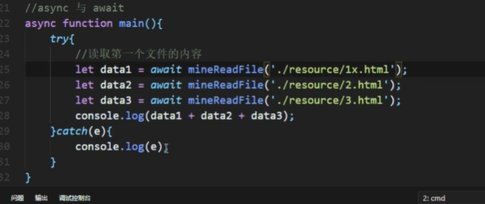

# ES7-async和await

## async和await

`Promise`虽然摆脱了回调地狱，但是`then`的链式调⽤也会带来额外的阅读负担，并且`Promise`传递中间值⾮常麻烦。

### async函数

- **async的函数**<font color=red>返回对象</font>是一个`promise`对象
  - 返回的`promise`对象的结果 由`async`函数执行的返回值`return`决定

  - **async**和then方法的**返回对象**规则是一样的

### await函数

- `await`右侧的表达式一般是`promise`对象，但也可以是其他值

  - 如果右侧表达式是`promise`对象，`await`返回的是`promise`<font color=red>成功的值</font>

  - 如果右侧表达式是其他值，直接将此值作为`await`的返回值

  - **如果`await`的`promise`失败了，就会抛出异常，需要通过`try...catch`处理**

    ```js
    // 将可能失败部分的代码包裹在try...catch中
    try {
            const res3 = await p2
            console.log(p2);
        } catch (error) {
            console.log(error);
        }
    ```

> 注意
>
> - `await`必须写在`async`函数中，但`async`函数中可以没有`await`。
>
> - 只有当await后面的异步操作执行完毕后,才会继续执行后面代码，**因此保证了顺序**。

同时，在错误处理方面，用`async/await`会比的纯回调函数更方便，只需要使用`try...catch`包裹代码即可。

而且，在`async/await`方法中在，看不到回调函数形式的代码。




