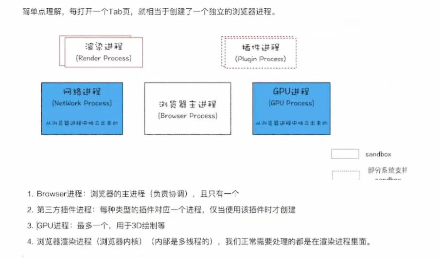
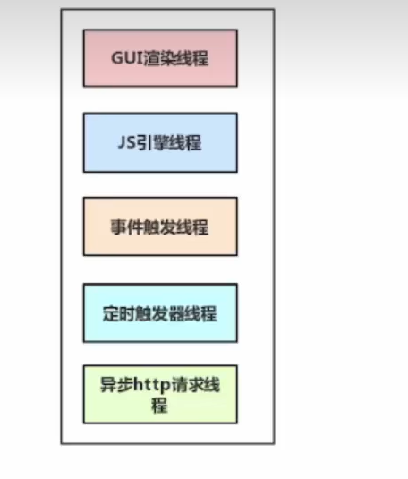
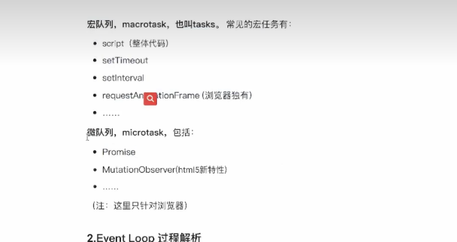
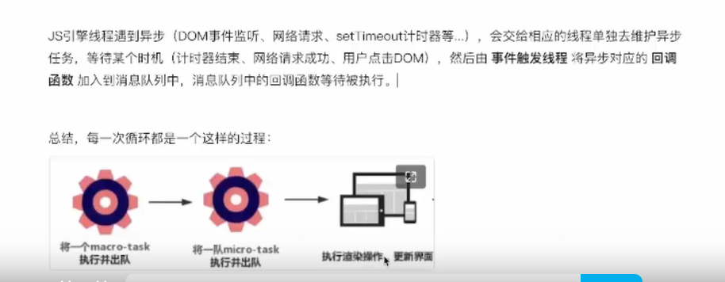
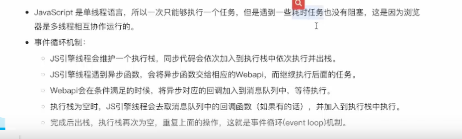
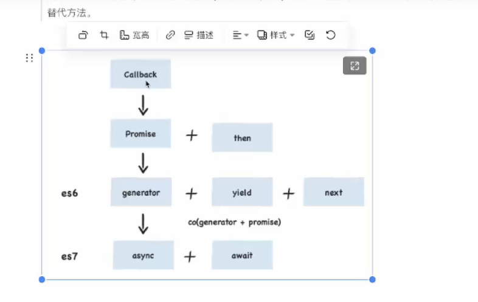

# JS异步编程和Promise

## 进程和线程

JS是单线程的，同一时刻只能执行特定的任务，而浏览器是多线程的。

单线程就意味着，所有任务需要排队，前一个任务结束，才会执行后一个任务。如果前一个任务耗时很长，后一个任务就不得不一直等着。

js引擎执行异步代码而不用等待，是因有为有 消息队列和事件循环。

消息队列：消息队列是一个先进先出的队列，它里面存放着各种消息。
事件循环：事件循环是指主线程重复从消息队列中取消息、执行的过程。

进程之间相互独立

多个线程在进程中协作完成任务

同一进程下的多个线程共享程序的内存空间（包括代码段、数据集和堆等）

## 渲染进程

JS单线程主要说的是JS执行代码顺序的逻辑是单线程的，在遇到耗时的任务，将任务交给浏览器中的线程处理。

补充：从浏览器输入URL会发生什么事？

就是GUI线程做的

evnet loop 工作机制

## 异步编程方案

### 背景

回调地域

